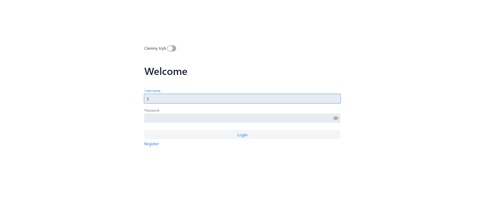
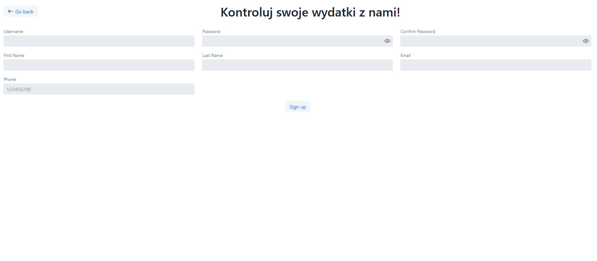
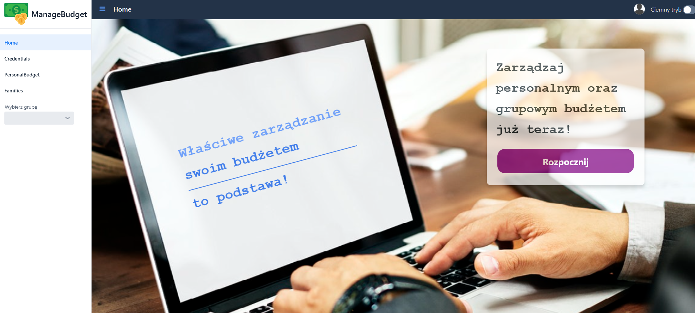
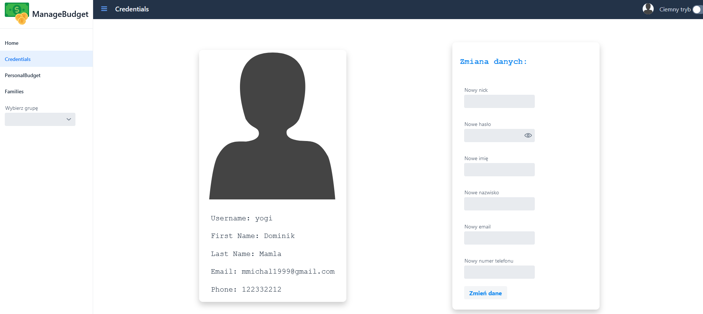
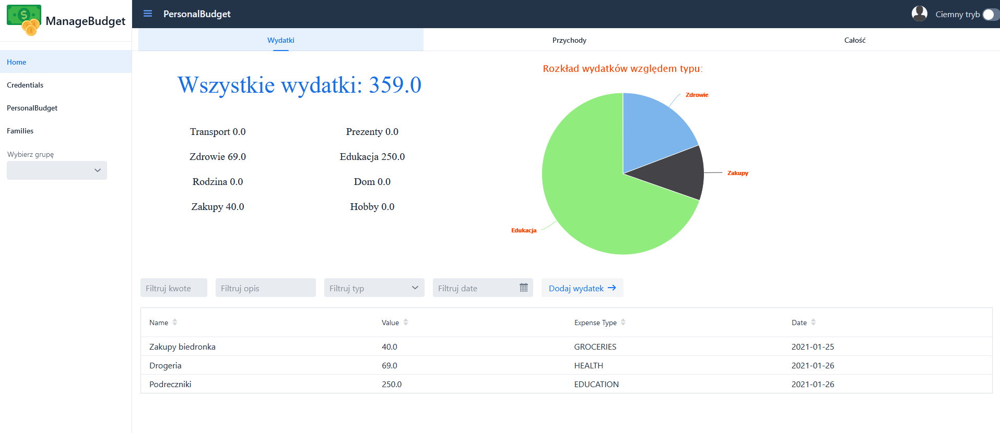
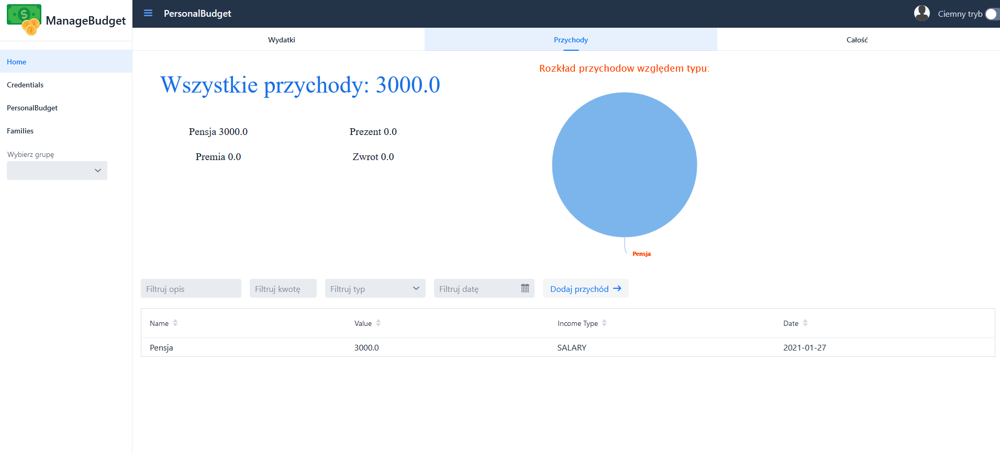
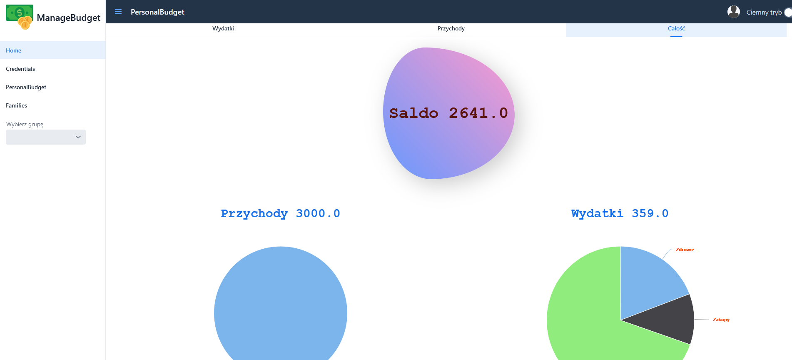
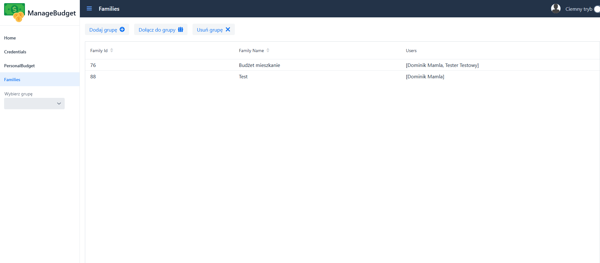
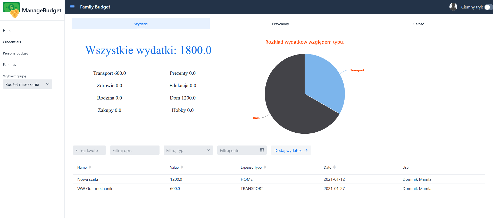
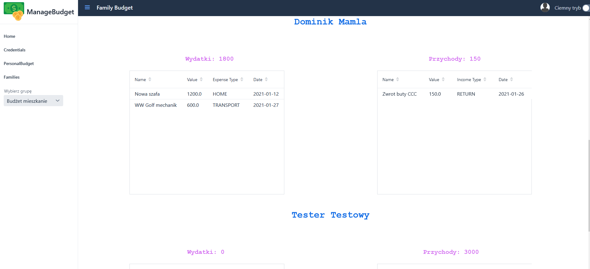

# Manage_Home_Budget
>Local-hosted web application made for university lessons during 3rd year.

## Table of contents
* [General](#general)
* [Screenshots](#screenshots)
* [Techstack](#techstack)
* [Features](#features)
* [MySQL configuration](#mysql-configuration)
* [Status](#Status)
* [Contact](#Contact)

## General
This is web application made to help tracking user incomes and expenses.\
It also provides "families budgets" which basically means budget for groups of people.

## Screenshots

  
  
  
  
  
  
  
  
  
  

## Techstack:
- Java 15
- Vaadin 14.4
- SpringBoot 2.4.1
- MySQL JDBC
- Lombok
- TestNG
- Maven

## Features
* register and login
* change user data
* dark/light theme
* attractive and simple design
* add, modify, delete expenses and incomes
* create and join families
* track all data shown of charts
* see tables with all data

## Mysql configuration

create database java_project_db   
create user 'java_project_user'@'%' identified by 'java_project_password'  
grant all on java_project_db.* to 'java_project_user'@'%';

## Status
This application is finished and will not be updated.
## Contact
This is a group project, if you have any questions, ask anyone of team members.

- Michał Mamla - https://github.com/bearyogi
- Grzegorz Podwika - https://github.com/GrzegorzPodwika
- Dominik Pepaś - https://github.com/Parry935